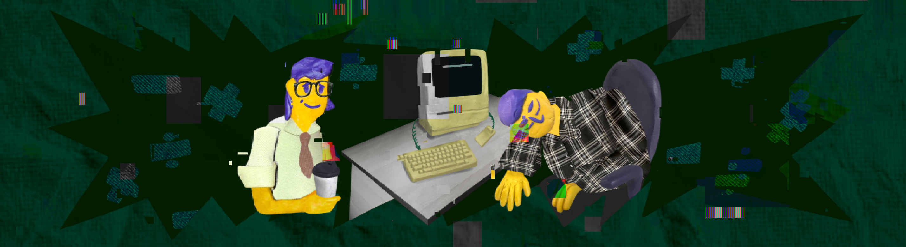

# SmartCalc v2.0

> При старте работы над проектом просим вас постараться хронометрировать время работы над проектом.
> По завершении работы над проектом просим вас ответить на два вопроса [в этом опросе](https://forms.gle/GmDeKHa7bJN3fKAo8)

Реализация SmartCalc v2.0.

## Contents

1. [Chapter I](#chapter-i) \
    1.1. [Introduction](#introduction)
2. [Chapter II](#chapter-ii) \
    2.1. [Information](#information)
3. [Chapter III](#chapter-iii) \
    3.1. [Part 1](#part-1-реализация-smartcalc-v20) \
    3.2. [Part 2](#part-2-дополнительно-кредитный-калькулятор) \
    3.3. [Part 3](#part-3-дополнительно-депозитный-калькулятор) 

## Chapter I

Планета Земля, США, штат Калифорния, где-то в Купертино, 20 августа 1983 года.

Крис поставил бумажный стаканчик с кофе рядом с вами на стол, тем самым разбудив вас.

*-- Чистый американо, слышал, ты его любишь. Поможет проснуться.*

*- Ох да, самое время, спасибо. На чем мы остановились?* - ответили вы запивая горячим кофе.

*-- Удалось закончить с базовой логикой для калькулятора?* 

*- А, пока еще в процессе. Летучка со Стивом завтра?*

*-- Именно так. Если сможем показать ему хоть какие-нибудь банальные арифметические операции с переработанной структурой программы, то думаю, что ему понравится.*

Вот уже больше недели вы по вечерам помогаете Крису Эспинозе переписывать калькулятор в объектно-ориентированном стиле. Последняя его версия в стандартном структурном подходе оказалась недостаточно гибкой и расширяемой для переполненного идеями Стива Джобса. Поэтому для решения этих проблем вы с Крисом решили попробовать только развивающуюся парадигму объектно-ориентированного программирования на молодом языке C++. Конечно, изучение новых технологий и вызвало.. некоторые затруднения, но есть надежда, что полностью переписывать калькулятор в восьмой раз уже не придется.

*- Что же, тогда ускоримся.*

*-- Кстати, я на днях пересекся с одним разработчиком из Норвегии: Торкве или Трюкве, не помню.* \
*Так вот, он рассказал про одну схему организации данных и логики приложения, которая позволяет очень гибко и быстро изменять некоторые компоненты. Например, мы можем полностью отделить интерфейс от остального кода, представляешь? И если Стиву в очередной раз что-то не понравится в интерфейсе, то это можно будет быстро и безопасно изменить. Даже тесты не понадобится переписывать для остальной логики.* 

*- Звучит как именно то, что нам нужно! Слушаю тебя.*

## Introduction

В данном проекте Вам предстоит реализовать на языке программирования С++ в парадигме объектно-ориентированного программирования расширенную версию обычного калькулятора, реализующую те же самые функции, что и разработанное ранее приложение в проекте SmartCalc v1.0. Помимо базовых арифметических операций, как плюс-минус и умножить-поделить, Вам необходимо дополнить калькулятор возможностью вычисления арифметических выражений с учетом приоритетов, а так же некоторыми математическими функциями (синус, косинус, логарифм и т.д.). Помимо вычисления выражений калькулятор так же должен поддерживать использование переменной x и построение графика соответствующей функции. В качестве дополнительных улучшений можно будет рассмотреть кредитный и депозитный калькулятор.

## Chapter II

## Information

Напоминаем, что для реализации калькулятора следует использовать *алгоритм Дейкстры* для перевода выражений в *обратную польскую нотацию*. Чтобы освежить свои знания, описания соответствующих понятий вы можете найти в описании к проекту SmartCalc v1.0.

### Паттерн MVC

Паттерн MVC (Model-View-Controller, Модель-Представление-Контроллер) представляет из себя схему разделения модулей приложения на три отдельных макрокомпонента: модель, содержащую в себе бизнес-логику, представление - форму пользовательского интерфейса для осуществления взаимодействия с программой и контроллер, осуществляющий модификацию модели по действию пользователя.

Концепция MVC была описана Трюгве Реенскаугом в 1978 году, работавшем в научно-исследовательском центре «Xerox PARC» над языком программирования «Smalltalk». Позже, Стив Бурбек реализовал шаблон в Smalltalk-80. Окончательная версия концепции MVC была опубликована лишь в 1988 году в журнале Technology Object. Впоследствии шаблон проектирования стал эволюционировать. Например, была представлена иерархическая версия HMVC; MVA, MVVM. 

Основная необходимость возникновения этого паттерна связана с желанием разработчиков отделить бизнес-логику программы от представлений, что позволяет легко заменять представления и переиспользовать реализованную единожды логику в других условиях. Отделенная от представления модель и контроллер для взаимодействия с ней позволяет эффективно переиспользовать или модифицировать уже написанный код. 

Модель хранит и осуществляет доступ к основным данным, производит по запросам операции, определенные бизнес-логикой программы, то есть отвечает за ту часть программы, которая отвечает за все алгоритмы и процессы обработки информации. Данные модели, изменяясь под действием контроллера, влияют на отображение информации на представлении пользовательского интерфейса. В качестве модели в данной программе должна выступить библиотека классов, осуществляющая вычисления калькулятора. Эта библиотека должна предоставлять все необходимые классы и методы для осуществления подсчетов. Это и есть бизнес-логика данной программы, так как предоставляет средства для решения задачи. 

Контроллер - тонкий макрокомпонент, который осуществляет модификацию модели. Через него формируются запросы на изменение модели. В коде это выглядит как некий "фасад" для модели, то есть набор методов, которые уже работают напрямую с моделью. Тонким он называется потому, что идеальный контроллер не содержит в себе никакой дополнительной логики, кроме вызова одного или нескольких методов модели. Контроллер выполняет функцию связующего элемента между интерфейсом и моделью. Это позволяет полностью инкапсулировать модель от отображения. Такое разделение полезно в силу того, что позволяет коду представления ничего не знать о коде модели и обращаться к одному лишь контроллеру, интерфейс предоставляемых функций которого, вероятно, не будет значительно меняться. Модель же может претерпевать значительные изменения, и, при "переезде" на другие алгоритмы, технологии или даже языки программирования в модели, потребуется поменять лишь небольшой участок кода в контроллере, непосредственно связанный с моделью. В противном случае, вероятнее всего, пришлось бы переписывать значительную часть кода интерфейса, так как он сильно зависел бы от реализации модели. Таким обазом, взаимодействуя с интерфейсом, пользователь вызывает методы контроллера, которые модифицируют модель.

К представлению относится весь код, связанный с интерфейсом программы. В коде идеального интерфейса не должно быть никакой бизнес-логики. Он только представляет форму для взаимодействия с пользователем.

## Chapter III

## Part 1. Реализация SmartCalc v2.0

Необходимо реализовать SmartCalc v2.0:

- Программа должна быть разработана на языке C++ стандарта C++17
- Код программы должен находиться в папке src
- При написании кода необходимо придерживаться Google Style
- Классы должны быть реализованы внутри пространства имен `s21`
- Подготовить полное покрытие unit-тестами модулей, связанных с вычислением выражений, c помощью библиотеки GTest
- Сборка программы должна быть настроена с помощью Makefile со стандартным набором целей для GNU-программ: all, install, uninstall, clean, dvi, dist, tests. Установка должна вестись в любой другой произвольный каталог
- Реализация с графическим пользовательским интерфейсом, на базе любой GUI-библиотеки с API для C++17: Qt, SFML, GTK+, Nanogui, Nngui и т. д.
- Программа должна быть реализована с использованием паттерна MVC, а также:
    - не должно быть кода бизнес-логики в коде представлений
    - не должно быть кода интерфейса в контроллере и в модели
    - контроллеры должны быть тонкими
- На вход программы могут подаваться как целые числа, так и вещественные числа, записанные и через точку, и в экспоненциальной форме записи
- Вычисление должно производится после полного ввода вычисляемого выражения и нажатия на символ `=`
- Вычисление произвольных скобочных арифметических выражений в инфиксной нотации
- Вычисление произвольных скобочных арифметических выражений в инфиксной нотации с подстановкой значения переменной _x_ в виде числа
- Построение графика функции, заданной с помощью выражения в инфиксной нотации с переменной _x_  (с координатными осями, отметкой используемого масштаба и сеткой с адаптивным шагом)
    - Не требуется предоставлять пользователю возможность менять масштаб
- Область определения и область значения функций ограничиваются по крайней мере числами от -1000000 до 1000000
    - Для построения графиков функции необходимо дополнительно указывать отображаемые область определения и область значения
- Проверяемая точность дробной части - минимум 7 знаков после запятой
- У пользователя должна быть возможность ввода до 255 символов
- Скобочные арифметические выражения в инфиксной нотации должны поддерживать следующие арифметические операции и математические функции:
    - **Арифметические операторы**:

        | Название оператора | Инфиксная нотация   (Классическая) | Префиксная нотация   (Польская нотация) |  Постфиксная нотация   (Обратная польская нотация) |
        | ------ | ------ | ------ | ------ |
        | Скобки | (a + b) | (+ a b) | a b + |
        | Сложение | a + b | + a b | a b + |
        | Вычитание | a - b | - a b | a b - |
        | Умножение | a * b | * a b | a b * |
        | Деление | a / b | / a b | a b \ |
        | Возведение в степень | a ^ b | ^ a b | a b ^ |
        | Остаток от деления | a mod b | mod a b | a b mod |
        | Унарный плюс | +a | +a | a+ |
        | Унарный минус | -a | -a | a- |

        >Обратите внимание, что оператор умножения содержит обязательный знак `*`. Обработка выражения с опущенным знаком `*` является необязательной и остается на усмотрение разработчика

    - **Функции**:
  
        | Описание функции | Функция |   
        | ---------------- | ------- |  
        | Вычисляет косинус | cos(x) |   
        | Вычисляет синус | sin(x) |  
        | Вычисляет тангенс | tan(x) |  
        | Вычисляет арккосинус | acos(x) | 
        | Вычисляет арксинус | asin(x) | 
        | Вычисляет арктангенс | atan(x) |
        | Вычисляет квадратный корень | sqrt(x) |
        | Вычисляет натуральный логарифм | ln(x) | 
        | Вычисляет десятичный логарифм | log(x) |

## Part 2. Дополнительно. Кредитный калькулятор

Предусмотреть специальный режим "кредитный калькулятор" (за образец можно взять сайты banki.ru и calcus.ru):
 - Вход: общая сумма кредита, срок, процентная ставка, тип (аннуитетный, дифференцированный)
 - Выход: ежемесячный платеж, переплата по кредиту, общая выплата

## Part 3. Дополнительно. Депозитный калькулятор

Предусмотреть специальный режим "калькулятор доходности вкладов" (за образец можно взять сайты banki.ru и calcus.ru):
 - Вход: сумма вклада, срок размещения, процентная ставка, налоговая ставка, периодичность выплат, капитализация процентов, список пополнений, список частичных снятий
 - Выход: начисленные проценты, сумма налога, сумма на вкладе к концу срока
